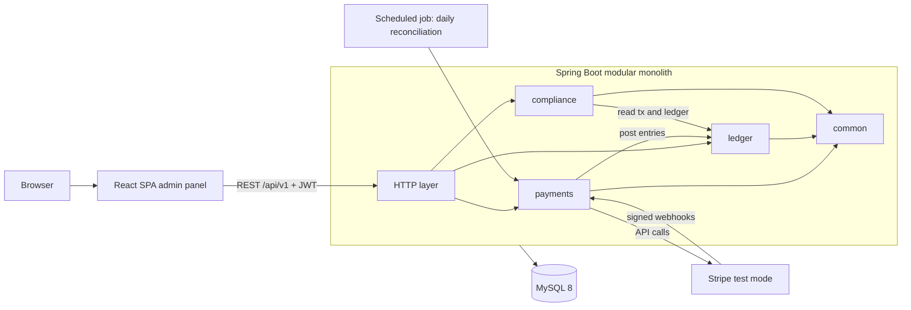

# Architecture

Living document. Sections marked **TBW** (to be written) are deliberately deferred to the phase indicated — they require domain understanding the owner builds in that phase's concept course.

## System context

Modular monolith (ADR-0001): one Spring Boot deployable, one MySQL database, module boundaries enforced by package structure and review. The React SPA talks to the versioned REST API; Stripe is the only external system.

## Module responsibilities

| Module | Owns | Key rule |
|---|---|---|
| `payments` | Stripe integration, payment/refund orchestration, webhook endpoint, payment state machine, reconciliation job | never sees or stores card data |
| `ledger` | chart of accounts, journal entries, balances, posting API | **sole writer** of ledger tables; append-only; balanced entries |
| `compliance` | KYC pipeline, monitoring rules, alerts, cases, audit hash chain | append-only audit; every action audited |
| `common` | shared config, error model, idempotency support, security plumbing | no business logic |

Cross-module interaction goes through Java interfaces (later, application events where they fit). Interaction details: TBW Phases 2 and 6.

## Design notes

| Topic | Status |
|---|---|
| Transaction & consistency boundaries | TBW Phase 2 |
| Ledger data model / ERD | TBW Phase 2 |
| Idempotency mechanism | TBW Phase 2 |
| Payment state machine (states, transitions, guards) | TBW Phase 2–3 |
| Webhook processing: signatures, ordering, retries | TBW Phase 3 |
| Reconciliation design | TBW Phase 3 |
| AuthN/AuthZ: JWT, roles | TBW Phase 4 |
| KYC state machine & trading gate | TBW Phase 5 |
| Rule engine & case model | TBW Phase 6 |
| Audit hash chain — tamper-*evident* (not tamper-proof), honest limits, anchoring option | TBW Phase 6 |
| Deployment view (AWS) | TBW Phase 7 |
