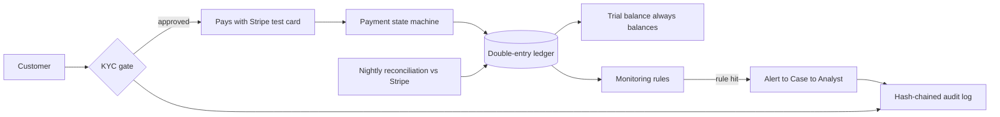

# LedgerPay — The System in Plain Words

> Read this whenever the project feels abstract. Architecture diagrams tell you how it's built; this tells you **what it is**.

## One trench coat, three things inside

LedgerPay is a miniature fintech backend. Money moves through it, every movement leaves proof, and a compliance desk watches the movements. Concretely, you are building three things wearing one trench coat:

1. **A money-movement engine** — payments come in through Stripe (test mode), balances live in wallets, money moves between wallets, refunds go back out. *(Phases 2–3)*
2. **A proof layer** — every movement writes a balanced double-entry record that can never be edited, only reversed; at any moment the system can *prove* the books balance (trial balance) and that history was not rewritten (hash-chained audit log). *(Phases 2, 6)*
3. **A compliance operations desk** — a KYC gate at the front door, monitoring rules watching every transaction, and suspicious activity turning into cases that a human analyst works and closes. *(Phases 5–6)*

Plus a window into all of it (the React panel, Phase 4) and a home for it (AWS, Phase 7).

## The five-minute demo scene — this is what "done" means

Every phase exists to make one beat of this scene real. When all seven beats work, the project is finished.

1. **Login.** You open the panel as an ops admin. Transactions, balances, cases — all live.
2. **The gate.** A new customer signs up and *cannot transact*: KYC pending. The analyst opens the review queue, checks the (fake, watermarked) document, approves with a reason code. The gate opens. Every click just landed in the audit log.
3. **Money in.** The customer pays RM 250 with test card `4242 4242 4242 4242`. On the payment's timeline: PENDING → AUTHORIZED → CAPTURED. Click into it: two ledger legs — DR `STRIPE_CLEARING` 25000 / CR `WALLET` 25000 sen.
4. **The proof.** Open the trial balance: every account's debits and credits, and at the bottom, global Σdebits == Σcredits, live. The books provably balance.
5. **The trap springs.** The seeder fires a burst: five transfers of RM 4,900 within an hour — a structuring pattern. A monitoring rule trips → alert → a case is created automatically. The analyst opens it, sees the linked transactions, writes a note, escalates it as a (simulated) STR.
6. **The party trick.** The auditor clicks *Verify chain* → green. Now run the tamper script that edits one old audit row directly in MySQL. Verify again → the chain breaks **exactly at that row**, red. Tamper-evident, demonstrated live.
7. **Trust but verify.** Last night's reconciliation report: zero discrepancies — or one deliberately seeded `MISSING_LOCAL`, to show detection works.

## Who lives in it

- **Customer** — passes KYC, pays, gets refunded. Never sees the machinery.
- **Ops admin** — watches money: transactions, ledger, balances, reconciliation.
- **Compliance analyst** — works the KYC queue and the case queue. The panel is their desk.
- **Auditor** — one button: *prove nothing was tampered with*.

## What each phase buys you

| Phase | Beat of the scene it unlocks | What you can claim afterwards |
|---|---|---|
| 0–1 | the stage exists | Spring Boot + REST + tested CRUD |
| 2 | beats 3–4 (internally) | **double-entry ledger, idempotency, state machine** — the résumé core |
| 3 | beats 3, 7 (real Stripe) | payment integration + webhooks + reconciliation → **Checkpoint A: a complete payments system** |
| 4 | beat 1 | React panel + JWT — the whole thing becomes visible |
| 5 | beat 2 | KYC pipeline — the compliance story begins |
| 6 | beats 5–6 | monitoring, cases, audit chain — **the flagship differentiator** |
| 7 | the theater goes public | live AWS deployment + the final README |

## What it is not

No real money, no real cards, no licenses, no microservices, no fraud ML. The binding list lives in `docs/scope.md` — when a shiny idea knocks, it goes to the Icebox there, not into the code.

## The sentence all of this buys

> "I built a **payments + compliance middle platform** — every money movement is backed by an **auditable double-entry ledger**, and **suspicious activity is automatically detected and case-managed**."

Clause one = Phases 2–4. Clause two = Phases 2 + 6. Clause three = Phases 5–6. When the sentence is fully true, stop building and go interview.
